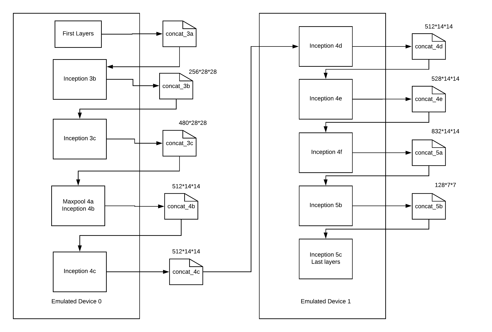

# Work instructions for testing GoogLeNet with channels
Here we are executing Googlenet with channels implementation inbetween the layers to avoid writing intermediate results into global memory. In Emulation mode, the IO channels are emulated as files. So every inception will write the intermediate results into a file via IO channel and next inception module will read the data from file. The architecture is shown below in this document.
### Googlenet with only IO channels:
- Plugin code for testing kernels with only IO channels is in `io_channels_testing_branch` branch
- GoogLeNet kernels with IO channels are saved in `pg-custonn2-2018/OpenCL_Kernels/Googlenet/inception_modules/googlenet_channels/kernels_testing_io_channels`
    - GoogleNet_Kernels_IO.cl (Kernels till Inception 4c)
    - GoogleNet_Kernels_IO_1.cl (Inception 4d to 5c and output layers)
- Use the make command to compile the kernels : `make io_emulation`
- Build the plugin
- initialize stratix 19.1 BSP : `source /opt/intelFPGA_pro/19.1/init_env_bittware_pcie.sh`
- emulate 2 devices : `export CL_CONTEXT_EMULATOR_DEVICE_INTELFPGA=2`
- Run the plugin :
    ./test_plugin -m /upb/scratch/departments/pc2/groups/pc2-cc-user/custonn2/intermediate_representation/GoogLeNet/frozen_quant.xml -i /upb/scratch/departments/pc2/groups/pc2-cc-user/custonn2/intermediate_representation/pepper.png 
### Googlenet Testing with global Memory:
- plugin code is in `noctua_plugin_new_googlenet` branch
- googlenet kernels with global memory design is in file : GoogleNet_Kernels_global.cl
- change the directory in make file to point to your local directory : change path of `test_dir`
- Use the make command to compile the kernels : `make global`
- Change line number 681 in the plugin to point the aocx to your test aocx since its hardcoded path.
- initialize stratix 19.1 BSP : `source /opt/intelFPGA_pro/19.1/init_env_bittware_pcie.sh`
- emulate 1 device : `export CL_CONTEXT_EMULATOR_DEVICE_INTELFPGA=1`
- Run the plugin :
    ./test_plugin -m /upb/scratch/departments/pc2/groups/pc2-cc-user/custonn2/intermediate_representation/GoogLeNet/frozen_quant.xml -i /upb/scratch/departments/pc2/groups/pc2-cc-user/custonn2/intermediate_representation/pepper.png
### Googlenet with IO and internal channels integrated:
- Plugin code for testing kernels with only IO channels is in `channels_testing` branch
- GoogLeNet kernels with IO channels are saved in `pg-custonn2-2018/OpenCL_Kernels/Googlenet/inception_modules/googlenet_channels/kernels_testing_io_channels`
    - GoogleNet_Kernels_channels_dynamic.cl (Kernels till Inception 4c)
    - GoogleNet_Kernels_channels_dynamic_1.cl (Inception 4d to 5c and output layers)
- We have the makefile to generate emulation bitstreams for these kernels. Please change the `test_dir` variable in the makefile. 
- Use the make command to compile the kernels : `make dynchan`
- Build the plugin
- initialize stratix 19.1 BSP : `source /opt/intelFPGA_pro/19.1/init_env_bittware_pcie.sh`
- emulate 2 devices : `export CL_CONTEXT_EMULATOR_DEVICE_INTELFPGA=2`
- Run the plugin :
    ./test_plugin -m /upb/scratch/departments/pc2/groups/pc2-cc-user/custonn2/intermediate_representation/GoogLeNet/frozen_quant.xml -i /upb/scratch/departments/pc2/groups/pc2-cc-user/custonn2/intermediate_representation/pepper.png -route /upb/scratch/departments/pc2/groups/pc2-cc-user/custonn2/intermediate_representation/GoogLeNet/route.xml -label /upb/scratch/departments/pc2/groups/pc2-cc-user/custonn2/intermediate_representation/GoogLeNet/labels.txt -nt 5
- **NOTE** : Please remove the emulated IO files before rerunning the plugin. `rm kernel_io_*`
### Testing Architecture:
